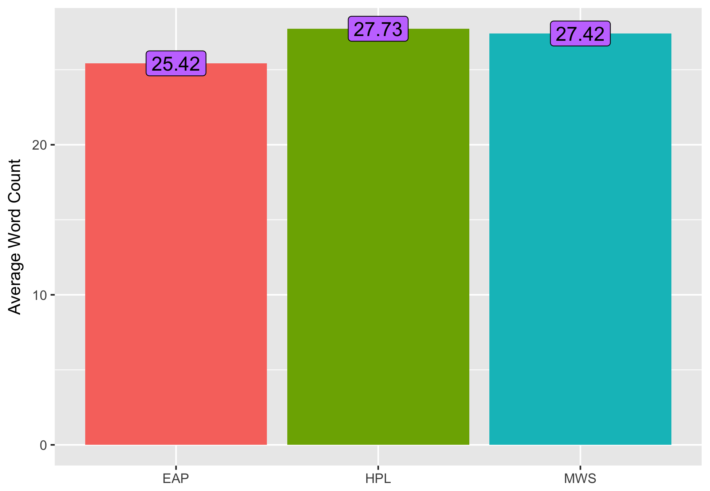
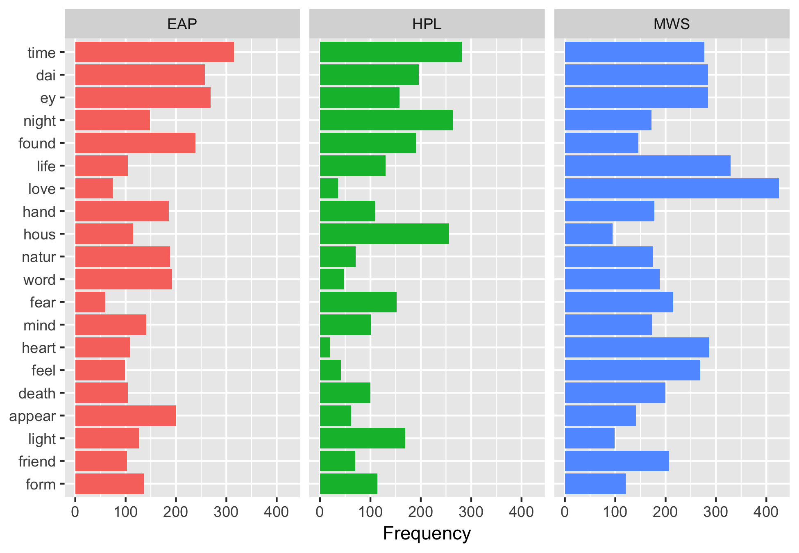
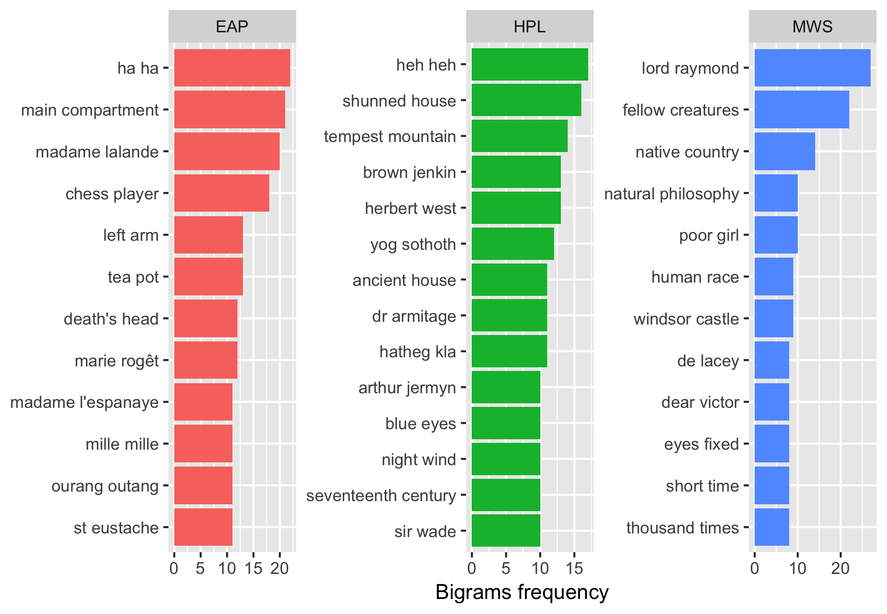
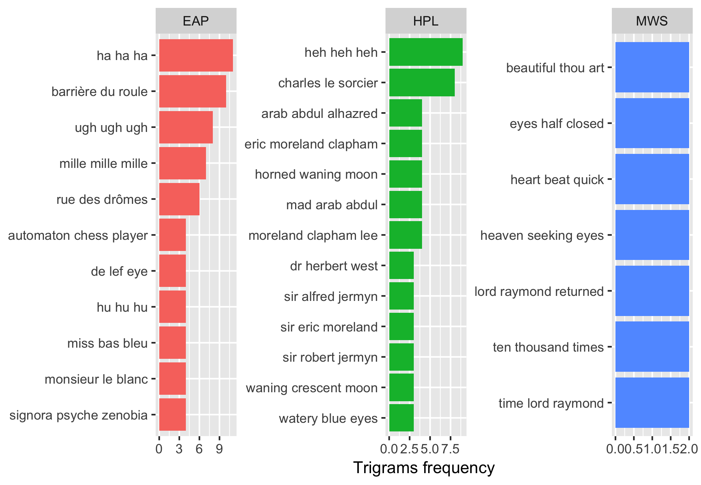
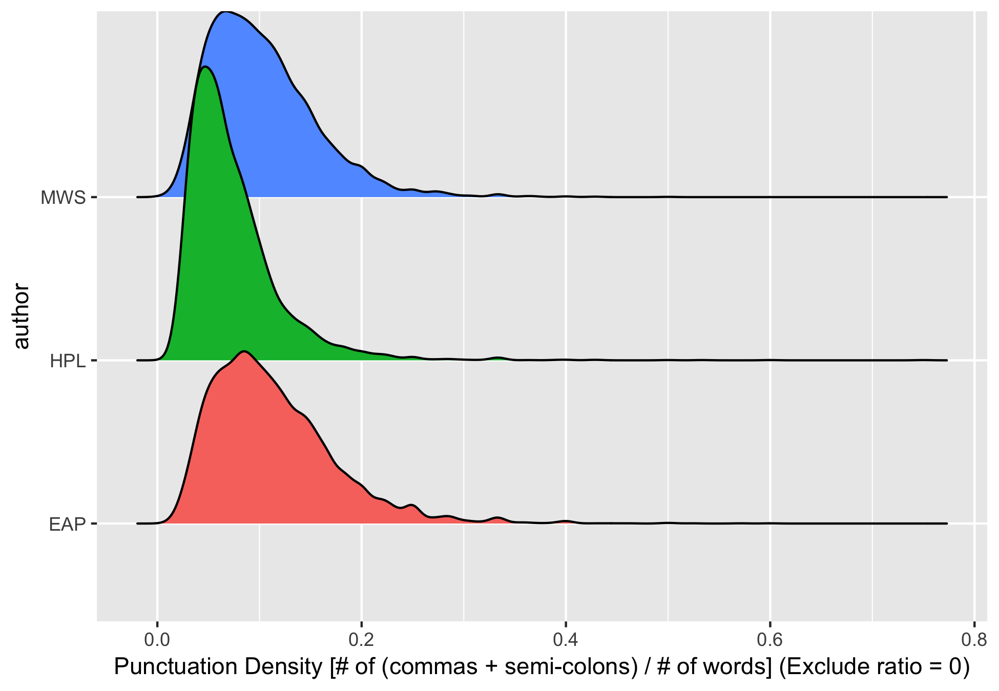
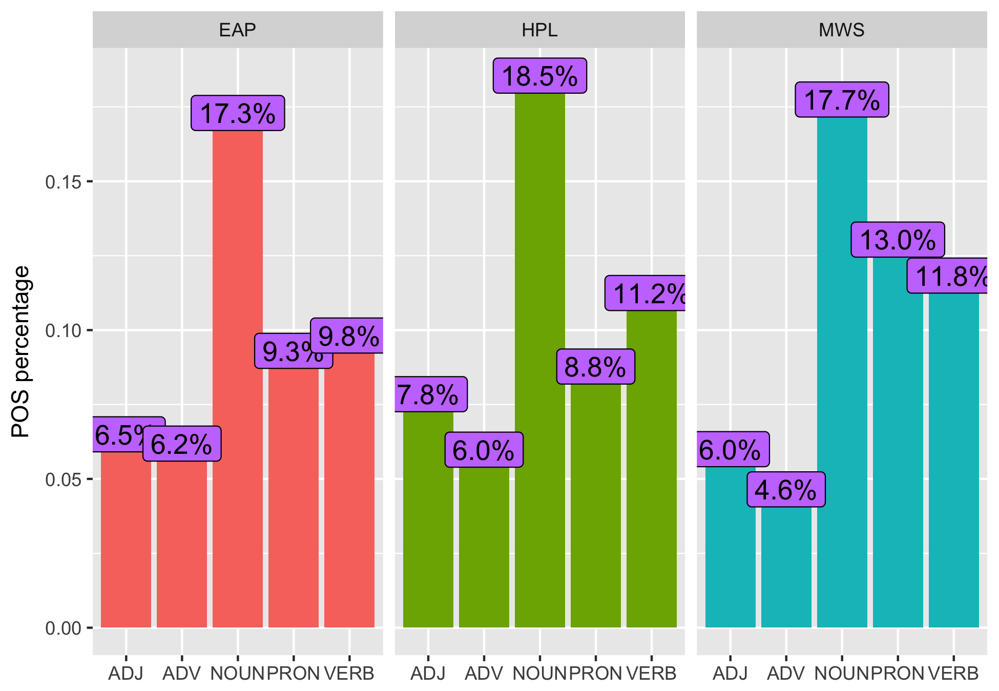
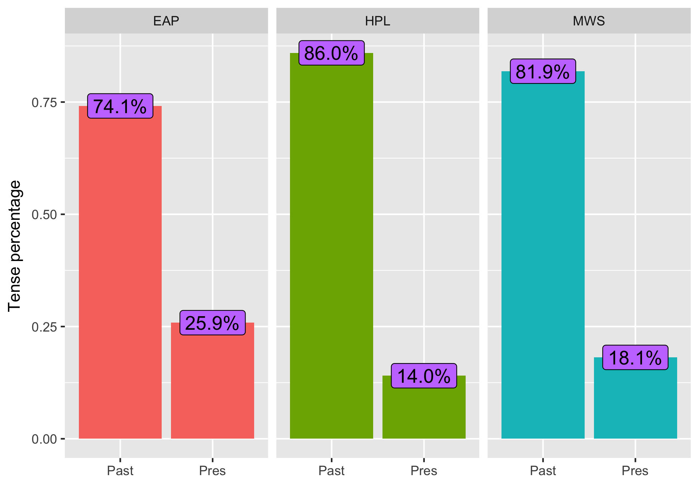
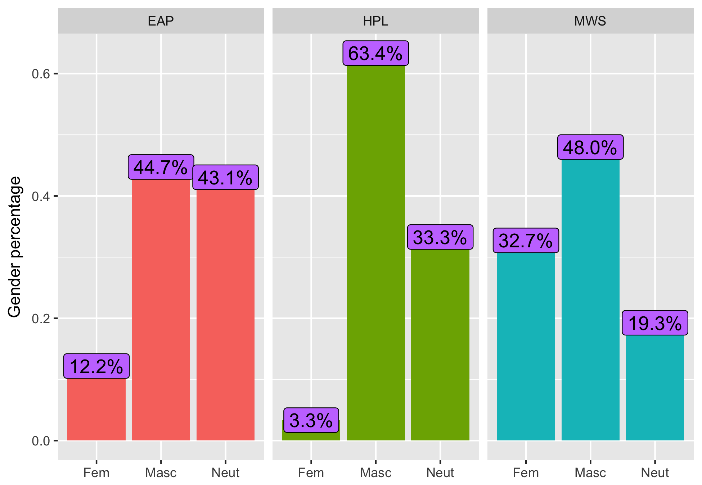
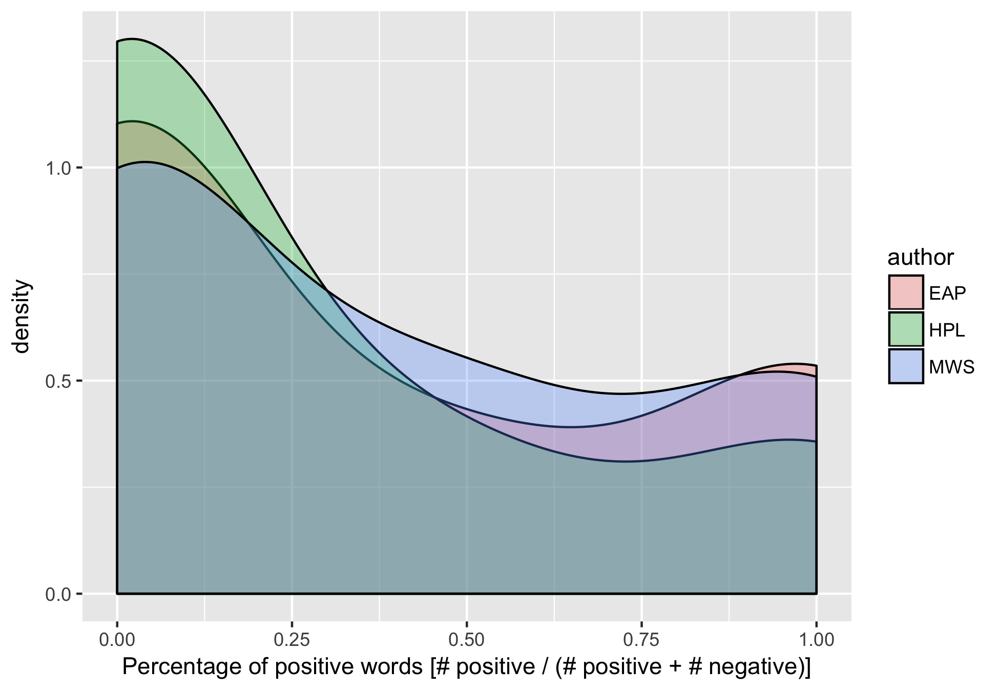
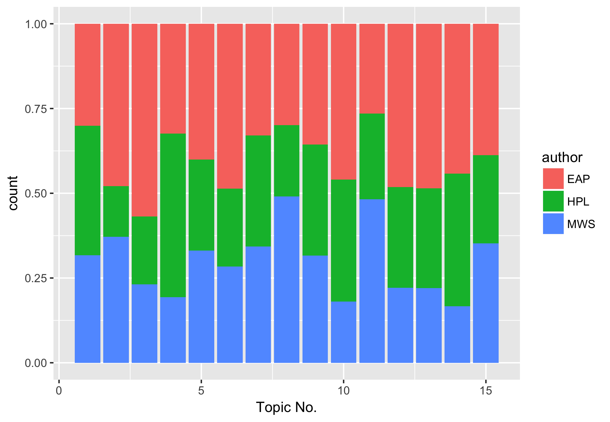

# Spring2018
# Project 1:

----

### Project1 SPOOKY data analysis (doc/)
This is the first and only *individual* (as opposed to *team*) this semester. 

Term: Spring 2018

+ Project title: SPOOKY Data Analysis
+ This project is conducted by Yang He, UNI: yh2825
+ Project summary: This project analyzes the excerpts of three different horror story authors, and aim to identify features and provide visualization for the dataset. Text Analysis, sentiment analysis and topic modelling are covered.
+ Note: More detailed explaination on graphs, analysis and conclusions are in the 'project1_yh2825.Rmd' file under 'doc' folder. Some of the wordcloud images are not loaded into this README file.

### What is the average sentence word length?

### What are the most frequent words (lemmatized) in thishorror story dataset? Bi-grams? Tri-grams?

First, let's count the top 20 frequent words, ignoring stop words, then see how the authors use them.

For bigrams:

For trigrams:

### Punctuations

Let's define a ratio of (# of commas + # of semi-colons)/(# of words in a senctence), and use this ratio to see how often the author uses subsentences. A lower ratio indicates less use of punctuations.

### Part of Speech

Let's pick 5 top arguabley most important POS, and see how the authors distribute their words.

### Tense

### Masculine or Feminine?

### Binary Sentiment on sentences.

By providing sentiment analysis on sentences, let's see what proportion of the author's excerpts are negative and positive, and to what scale.

### Topic Modelling

15 topics are chosen, and sentence level modelling are performed.

